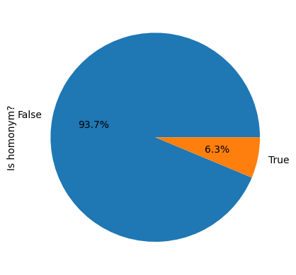
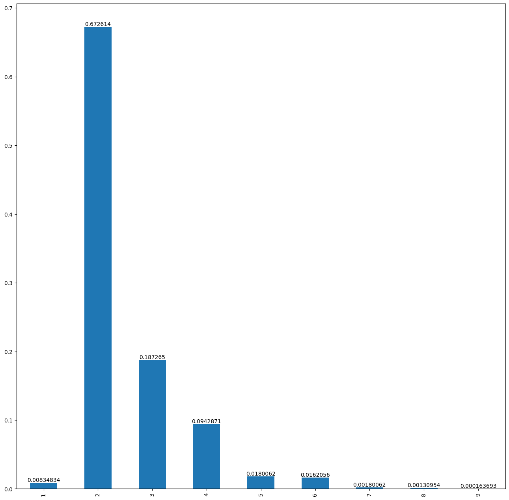
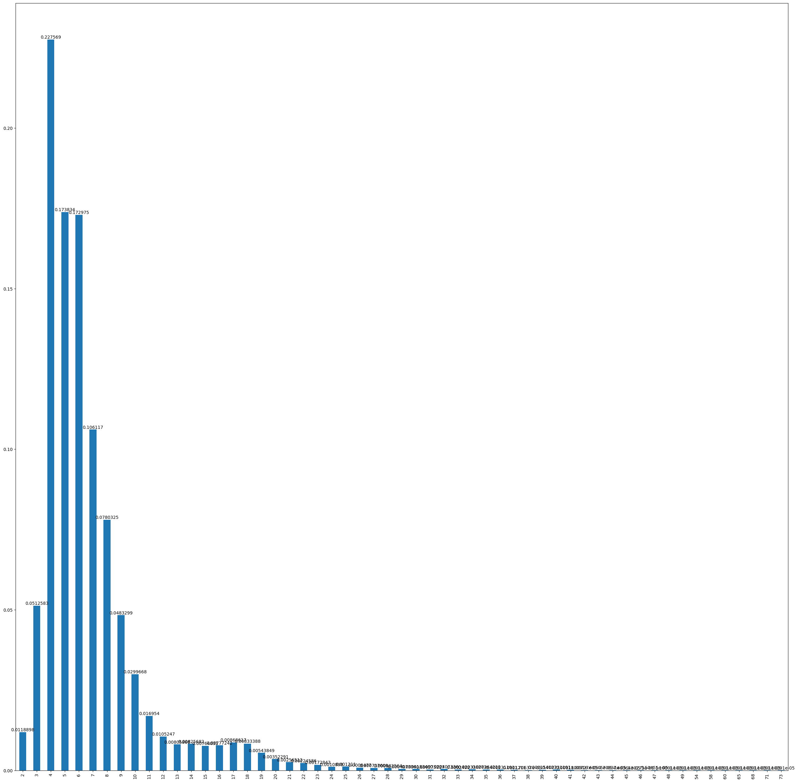

# Motivation

- There is a non-negligible number of homonyms in financial named entities such as company names
- Assume we simply check if specific patterns like financial named entities are contained within a corpus
- Then we are likely to find a significant number of false positives by homonyms. 

## Example: Company names

### Proportion

- E.g., 6.3% of the Korean company names are homonymous
- I retreived a list of the company names by using [josw123/dart-fss (GitHub)](https://github.com/josw123/dart-fss)

### Length

- Most of the homonymous company names are between 2 and 4 in length

- On the other hand, the non-homonymous company names have quite different characteristic

### `품사` (Part-Of-Speech, POS)

- Of course, most of the homonyms are NNP or NNG (almost 90%)

### `소스` (source `.csv` in which the vocabulary exists)

