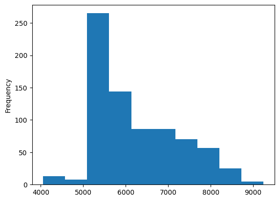
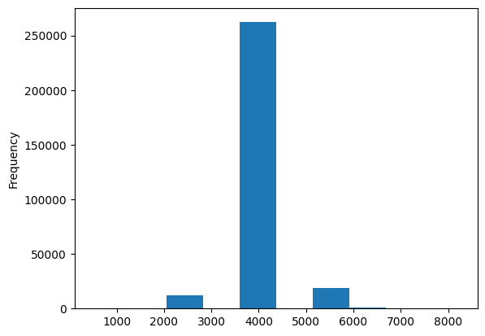

# Post-processing

## Morpheme analysis

### mecab-ko

- The NER models from the monologg/KoELECTRA are trained on the NAVER x Changwon NER
- Recall that the NAVER x Changwon NER doesn't exclude 조사 (postposition) from the tags:
- E.g.,

``` txt
1	그런	-
2	예산결산특별위원회의	ORG_B
3	의도는	-
4	요즘	-
5	6연승을	NUM_B
6	첫부분으로	-
7	맞아	-
8	떨어져가고	-
9	있다	-
10	.	-
```

- `의` is postposition, but it's included in the tag `예산결산특별위원회의	ORG_B`
- So the models generally include postposition in named entities
- we need to check whether a postposition exists in named entities and remove it if we use monologg/KoELECTRA models fine-tuned on the NAVER x Changwon NER
- We can address this issue by applying morpheme analysis on the named entities
- One of the most famous korean morpheme analysis packages is **mecab-ko**
- mecab-ko is a fork project of MeCab for korean morphological analysis

### Dictionary for the MeCab

- However, we need to create a user dictionary and add it into the mecab-ko to make it recognize the company names as proper names
- User dictionary for mecab-ko is a `.csv` file like:

| 표층형 | left-ID | right-ID | 비용 | 품사 태그 | 의미 부류 | 종성 유무 | 읽기 | 타입 | 첫번째 품사 | 마지막 품사 | 표현 |
| --- | --- | --- | --- | --- | --- | --- | --- | --- | --- | --- | --- |
| 태양 |  |  |  | NNG | * | T | 태양 | * | * | * | * |
| 서울 |  |  |  | NNP | 지명 | T | 서울 | * | * | * | * |
| 불태워졌 |  |  |  | VV+EM+VX+EP |  | T | 불태워졌 | Inflected | VV | EP | 불태우/VV/*+어/EC/*+지/VX/*+었/EP/* |
| 해수욕장 |  |  |  | NNG |  | T | 해수욕장 | Compound | * | * | 해수/NNG/*+욕/NNG/*+장/NNG/* |

- Refer the table below for more details about the columns:

| column | description |
| --- | --- |
| 표층형 (surface form) | form of the word as it appears in the text |
| left-ID | identifier of the left context |
| right-ID | identifier of the right context |
| 비용 (cost) | priority of the word |
| 품사 태그 (POS tag) | POS type of the word |
| 의미 부류 | category to which the meaning of the word belongs |
| 종성 유무 | Does the word have jongseong? |
| 읽기 | pronunciation of the word |
| 타입 | used to decompose the word if it belongs to a compound noun |
| 첫번째 품사 | POS type of first morpheme of the compound noun |
| 마지막 품사 | POS type of last morpheme of the compound noun |
| 표현 | How the compound noun is formed |

### Cost (Priority) adjustment

- Main challenge of this process is adjusting a cost of each company name
- The costs are highly related to solving ambiguity
- E.g., increase the cost if we want to decrease the priority, and decrease the value if we want to increase the priority
- But it’s difficult to select the appropriate cost for each company name manually
- So I decided to set their costs based on default dictionary in mecab-ko-dic
- There are a lot of homonyms in the default dictionary and it relieves the ambiguity by assigning a high cost (low priority) to words which are less used ones
- E.g., one-letter vocabulary in `Person.csv` and `Person-actor.csv` provided by mecab-ko-dic have much higher proportion of homonyms
- So a trend of the costs of one-letter vocabulary also significantly different:


Figure 1. A bar chart showing the frequency of cost of a one-letter vocabulary in Person.csv and Person-actor.csv             | Figure 2. A bar chart showing the frequency of cost of two or more letter vocabulary in Person.csv and Person-actor.csv
:-------------------------:|:-------------------------:
  |  

- E.g., Adjusting costs of the korean company names:

1. Make sure the name we want to add already exists in current dictionary
2. If it already exists, set the cost lower than any homonyms
3. If it doesn't exist, set the cost as the mean of the costs of words with the same number of characters

- Refer to the function `create_user_dictionary` implemented in `./notebook.ipynb` for more details